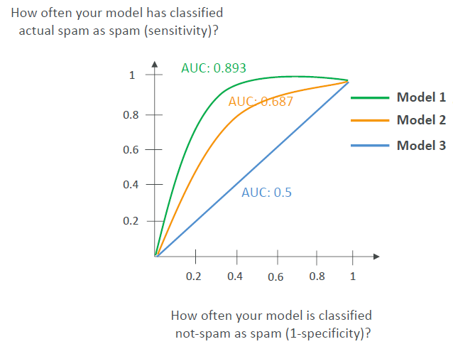

# What is Artificial Intelligence (AI)?  
* AI is a broad field for the development of intelligent systems capable of performing tasks that typically require human intelligence:  
    - Perception
    - Reasoning
    - Learning
    - Problem solving
    - Decision-making  
* Umbrella-term for various techniques  

   

## AI use cases  
* Computer Vision - self drinivg cars  
* Facial Recognition 
* Fraud Detection  
* Intelligent document processing (IDP)  

## AI Components  
* Data Layer - collect vast amount of data.  
* ML Framework and Algorithm Layer - data scientists and engineer work together to understand use cases,requirements, and frameworks that can solve them.  
* Model Layer - implement a model and train it.  
* Application Layer - how to serve the model, and its capabilities for your users.  

   

# What is Machine Learning (ML)?  
* ML is a type of AI for building methods that allow machines to learn.  
* Data is leveraged to improve computer performance on a set of task.  
* Make predictions based on data used to train the model.  
* No explicit programming of rules.  

# What is Deep Learning (DL)?  
* It is a subset of ML and uses neurons and synapses (like our brain) to train a model.  
* Process more complex patterns in the data than traditional ML.  
* Deep Learning because there’s more than one layer of learning (input layer, hidden layer, output layer).  

   

* Ex: Computer Vision - image classification, object detection etc.  
* Ex: Natural Language Processing (NLP) - text classification, sentiment analysis, machine translation, language generation.  
* It requires a large amount of input data.  
* It requires GPU (Graphical Processing Unit).  
* Neural networks may have billions of nodes.  

# What is Generative AI (Gen-AI)?  
* A subset of DL.  

   

* It is a Multi-purpose foundation models backed by neural networks.  
* They can be fine-tuned if necessary to better fit our use-cases.  

# What is the Transformer Model? (LLM)  
* Able to process a sentence as a whole instead of word by word.  
* Faster and more efficient text processing (less training time).  
* It gives relative importance to specific words in a sentence.  
* Transformer-based LLMs  
    - Powerful models that can understand and generate human-like text.  
    - Trained on vast amounts of text data from the internet, books, and other sources, and learn patterns and relationships between words and phrases.  
    - Example: Google BERT, OpenAI ChatGPT (Chat Generative Pretrained Transformer).  

# Multi-modal Models  
* Does NOT rely on a single type of input (text, or images, or audio only).  
* Does NOT create a single type of output.  
* Example: a multi-modal can take a mix of audio, image and text and output a mix of video, text for example.  

  

# Humans are a mix of AI  
* Sometimes we know “if this happens, then do that” = (AI)  
* Sometimes we’ve seen a lot of similar things before, and we classify them = (Machine Learning)  
* Sometimes we haven’t seen something before, but we have “learned” a lot of similar concepts, so we can make a decision = (Deep Learning)  
* Sometimes, we get creative, and based on what we’ve learned, we can generate content: Gen AI  

# ML Terms You May Encounter in the Exam  
* GPT (Generative Pre-trained Transformer) - generate human text or computer code based on input prompts.  
* BERT (Bidirectional Encoder Representations from Transformers) - similar intent to GPT, but reads the text in two directions.  
* RNN (Recurrent Neural Network) - meant for sequential data such as time-series or text, useful in speech recognition, time-series prediction.  
* ResNet (Residual Network) - Deep Convolutional Neural Network (CNN) used for IMAGE Recognition, OBJECT DETECTION, and FACIAL Recognition.  
* SVM (Support Vector Machine) - ML algorithm for classification and regression.  
* WaveNet - model to generate raw audio waveform, used in Speech Synthesis.  
* GAN (Generative Adversarial Network) - models used to generate synthetic data such as images, videos or sounds that resemble the training data. Helpful for data augmentatio. If we have training dataset with underrepresented categories, then we can use GAN to actually generaate fake data, but that still going to be looking like our original data in order for our next model to have a trained dataset that is going to be more balanced.  
* XGBoost (Extreme Gradient Boosting) - an implementation of gradient boosting.  

# Training data  
* To train our model we must have good data.  
* If we put Grarbage(bad data) into our model we are gonna get garbage out of our model.  

## Labeled Data vs Unlabeled Data  
* Labeled data  
    - Data include both input features and corresponding output labels. 
    - Example : dataset with images of animals where each image is labeled with the corresponding animal type (e.g., cat, dog).  
    - Use case: <mark>Supervised Learning</mark>, where the model is trained to map inputs to known outputs.   

* Unlabeled data  
    - Data includes only input features without any output labels. 
    - Example: a collection of images without any associated labels.  
    - Use case: <mark>Unsupervised Learning</mark>, where the model tries to find patterns or structures in the data.  

  

## Structured Data  
* Data is organized in a structured format, often in rows and columns (like Excel).  
* Tabular Data  
    - Data is arranged in a table with rows representing records and columns representing features.  
    - Example: customers database with fields such as name, age, and total purchase amount.  

  

* Time Series Data   
    - Data points collected or recorded at successive points in time.  
    - Example: Stock prices recorded daily over a year.  

 

## Unstructured Data  
* Data that doesn't follow a specific structure and is often text-heavy or multimedia content.  
* Text Data  
    - Unstructured text such as articles, social media posts, or customer reviews.  
    - Example: a collection of product reviews from an e-commerce site.  
* Image Data  
    - Data in the form of images, which can vary widely in format and content.  
    - Example: images used for object recognition tasks.  

# ML Algorithms - Supervised Learning  
* Needs labeled data.  
* Learn a mapping function that can predict the output for new unseen input data.  

 

## Supervised Learning - Regression
* Used to predict a numeric value based on input data.  
* The output variable is <mark>continuous</mark>, meaning it can take any value within a range.  
* Use cases: used when the goal is to predict a quantity or a real value.  
* Examples:  
    - Predicting House Prices - based on features like size, location, and number of bedrooms.  
    - Stock Price Prediction - predicting the future price of a stock based on historical data and other feature.  
    - Weather Forecasting - predicting temperatures based on historical weather data.  

## Supervised Learning - Classification  
* Used to predict the categorical label of input data.  
* The output variable is <mark>discrete</mark>, which means it falls into a specific category or class.  
* Use cases: scenarios where decisions or predictions need to be made between distinct categories (fraud, image classification, customer retention, diagnostics).  
* Examples:  
    - Binary Classification - classify emails as "spam" or "not spam".  
    - Multiclass Classification - classify animals in a zoo as "mammal," "bird," "reptile”.  
    - Multi-label Classification - assign multiple labels to a movie, like "action" and "comedy".  

  

# Training vs. Validation vs. Test Set  
* Training Set  
    - Used to train the model.  
    - Percentage: typically, 60-80% of the dataset.  
* Validation Set  
    - Used to tune model parameters and validate performance.  
    - Percentage: typically, 10-20% of the dataset.  
* Test Set  
    - Used to evaluate the final model performance.  
    - Percentage: typically, 10-20% of the dataset.  

 

# Feature Engineering  
* The process of using domain knowledge to select and transform raw data into meaningful feature.  
* Helps enhancing the performance of machine learning models.  
* Particularly meaningful for Supervised Learning. 
* It is used to create new input labels so that we caan have our ML algorithum perform better.  
* Technique  
    - Feature Extraction - extracting useful information from raw data, such as deriving age from date of birth.  
    - Feature Selection - selecting a subset of relevant features, like choosing important predictors in a regression model.  
    - Feature Transformation - transforming data for better model performance, such as normalizing numerical data.  

  

# ML Algorithms – Unsupervised Learning  
* The goal is to discover inherent patterns, structures, or relationships within the input data.  
* Feature Engineering can help improve the quality of the training.  
* Common techniques include Clustering, Association Rule Learning , and Anomaly Detection.  

## Unsupervised Learning – Clustering Technique  
* Used to group similar data points together into clusters based on their features.  
* Outcome: The company can target each segment with tailored marketing strategies.  

     

## Unsupervised Learning – Association Rule Learning Technique  
* Here we want to understand which products are frequently bought together in supermarket.  
* For example : according to data those who buy bread are most likely to purchase butter so maybe it is a great idea to put bread and butter together.  
* Outcome: the supermarket can place associated products together to boost sales.  

## Unsupervised Learning – Anomaly Detection Technique  
* Used in fraud detection.  
* The goal is to identify transcations that deviate typically from significant behaviour.  

# Semi-supervised Learning  
* Use a small amount of labeled data and a large amount of unlabeled data to train systems.  
* After that, the partially trained algorithm itself labels the unlabeled data.  
* This is called <mark> pseudo-labeling</mark>.  

# Self Supervised Learning  
* The idea is that we have the model generate its own pseudo-labels by using pre-text tasks.  

# What is Reinforcement Learning (RL)?  
* A type of Machine Learning where an agent learns to make decisions by performing actions in an environment to maximize cumulative rewards.  
* Key Concepts  
    - Agent – the learner or decision-maker.  
    - Environment – the external system the agent interacts with.  
    - Action – the choices made by the agent.  
    - Reward – the feedback from the environment based on the agent’s actions.  
    - State – the current situation of the environment.  
    - Policy – the strategy the agent uses to determine actions based on the state.  

## Applications of Reinforcement Learning  
* Gaming – teaching AI to play complex games (e.g., Chess, Go).  
* Robotics  
* Finance – portfolio management.  
* Healthcare – optimizing treatment plans.  
* Autonomous Vehicles – path planning and decision-making.  

# What is RLHF?  
* RLHF = Reinforcement Learning from Human Feedback.  
* Use human feedback to help ML models to self-learn more efficiently.  
* RLHF incorporates human feedback in the reward function, to be more aligned with human goals, wants and needs.  
* RLHF is used throughout GenAI applications including LLM Models.  
* RLHF significantly enhances the model performance.  

## How does RLHF work? Example: internal company knowledge chatbot  
* Data collection  
    - Set of human-generated prompts and responses are created.  
    - “Where is the location of the HR department in Boston?”  
* Supervised fine-tuning of a language model  
    - Fine-tune an existing model with internal knowledge  
    - Then the model creates responses for the human-generated prompts.  
    - Responses are mathematically compared to human-generated answers.  
* Build a separate reward model  
    - Humans can indicate which response they prefer from the same prompt.  
* Optimize the language model with the reward-based model   
    - Use the reward model as a reward function for RL.  
    - This part can be fully automated.  

# Model Fit  
* In case your model has poor performance, you need to look at its fit.  

## Overfitting  
* Performs well on the training data.  
* Doesn’t perform well on evaluation data.  

## Underfitting  
* Model performs poorly on training data.  
* Could be a problem of having a model too simple or poor data features.  

## Balanced  
* Neither overfitting or underfitting.  

   

# Bias and Variance  
## Bias  
* Difference or error between predicted and actual value.  
* Occurs due to the wrong choice in the ML process.  
* High Bias  
    - The model doesn’t closely match the training data.  
    - Considered as underfitting.  
* Reducing the Bias  
    - Use a more complex model.  
    - Increase the number of features in data.  

  

## Variance  
* How much the performance of a model changes if trained on a different dataset which has a similar distribution.  
* High Variance  
    - Model is very sensitive to changes in the training data.  
    - This is the case when overfitting: performs well on training data, but poorly on unseen test data.  
* Reducing the Variance  
    - Feature selection (less, more important features).  
    - Split into training and test data sets multiple times.  

  

<mark> Overfitting = High Variance  
Underfitting = High Bias  
Balanced = Low Bias, Low Variance </mark>

  
  

# Model Evaluation Metrics

  

## Confusion Matrix  

  

* True Positive = It means the predicted value is positive (spam) and the actual value was positive (spam).
    - It means we predicted it to be a spam and actually it was a spam
* False Negative = It means the predicted value is negative (not spam) and actual result is positive (spam).  
    -   It means we predicted it to be not a spam but actually it was a spam.  
* False Positive = It means the predicted value is positive (spam) and actual value is negative (not spam).  
    -   It means we thought it was a spam but actually it was not a spam. 
* True Negative = It means the predicted value is negative (not spam) and the actual value is negative (not spam).  
    - It means we thought it to be not spam and actually it was not a spam.  

* We want to maximise the number of true positive and true negative and minimise the number of fasle positive and false negative.  

* The precision, the recall, the F1 and the accuracy are the metrices used to evaluate the accuracy of binary classification.  
* Confusion Matrix is used to evaluate the performance of a model that does classifications.  

## AUC-ROC (Area under the curve-receiver operator curve)  
* Value from 0 to 1 with 1 being perfrct model.  
* AUC-ROC shows what the curve for true positive compared to false positive looks like at various thresholds.  

    

## Model Evaluation – Regressions Metrics  
* MAE = Mean Absolute Error between predicted and actual values.  
* MAPE = Mean Absolute Percentage Error.  
* RMSE = Root mean squared error (RMSE).  
* R² (R Squared): explains variance in your model R² close to 1 means predictions are good.  
* MAE, MAPE, RMSE, R² are metrices used to give the quality of a regression and to see it it is going to be acceptable for us or not.  
* They are used for evaluating models that predict a continous value (i.e., regression).  

# Machine Learning – Inferencing  
* Inferencing is when a model is making prediction on new data.  
* Real Time  
    - Computers have to make decisions quickly as data arrives.  
    - Speed is preferred over perfect accuracy.  
    - Examples = Chatbot  

* Batch  
    - Large amount of data is analysed all at once.  
    - Often used for data analysis.  
    - Accuracy is prefered over speed.  

# Phases of Machine Learning Project  

  

* Define business goals  
    - Stakeholders define the value, budget and success criteria.  
    - Defining KPI (Key Performance Indicators) is critical.  

* ML problem framing  
    - Convert the business problem and into a machine learning problem.  
    - Determine if ML is appropriate.  
    - Data scientist, data engineers and ML architects and subject matter experts (SME) collaborate.  

* Data processing  
    - Convert the data into a usable format.  
    - Data preprocessing and data visualization (understandable format).  
    - Feature engineering: create, transform and extract variables from data.  

* Model development  
    - Model training, tuning, and evaluation.  
    - Iterative process.  

* Retrain  
    - Look at data and features to improve the mode.  

* Deployment  
    - If results are good, the model is deployed and ready to make inferences.  
    - Select a deployment model (real-time, serverless, asynchronous, batch, on-premises…).  

* Monitoring  
    - Deploy a system to check the desired level of performance.  
    - Early detection and mitigation.  

* Iterations 
    - Model is continuously improved and refined as new data become available.  
    - Requirements may change.  
    - Iteration is important to keep the model accurate and relevant over time.  

# What to do if overfitting?  
* Overfitting is when the model gives good predictions for training data but not for the new data.  
* It occurs due to:  
    - Training data size is too small and does not represent all possible input values.  
    - The model trains too long on a single sample set of data.  
* How can you prevent overfitting?  
    - Increase the training data size  
    - Early stopping the training of the model  
    - Data augmentation (to increase diversity in the dataset).  

    

